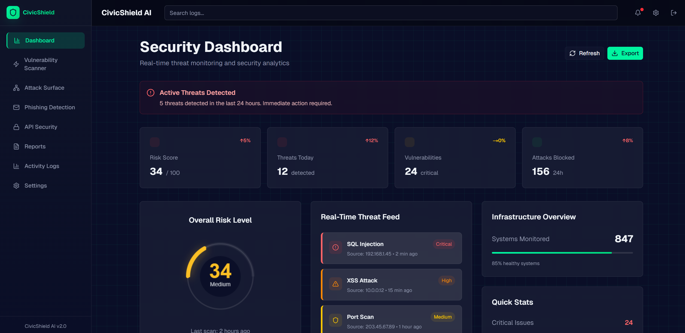
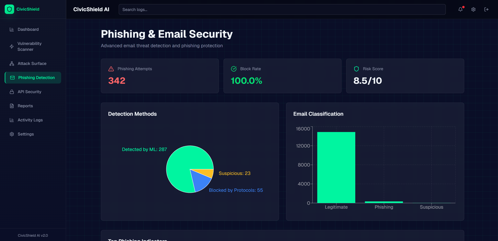
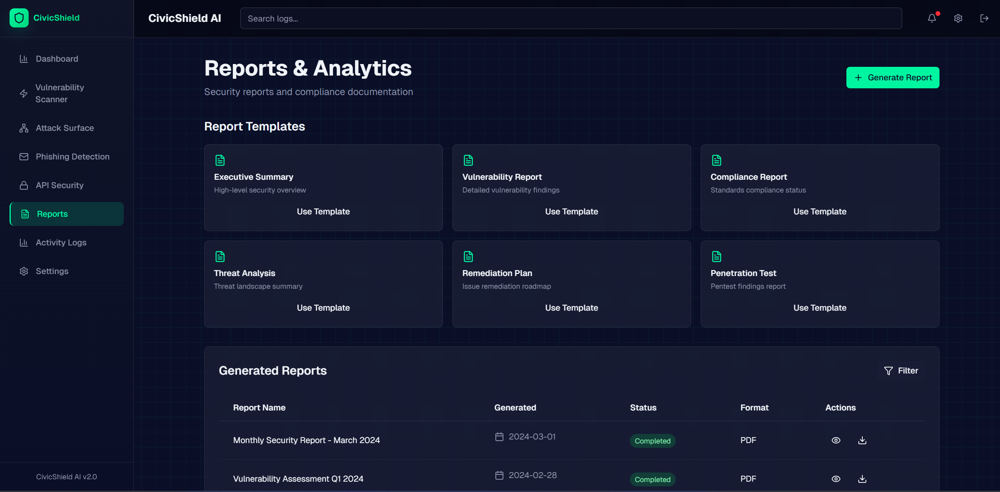

<div align="center">


<br/><br/>

# 🛡️ CivicShield AI

### Enterprise-Grade AI Cybersecurity Intelligence Platform

**Real-time threat detection · Vulnerability scanning · Phishing protection · Attack surface mapping**

[🚀 Live Demo](#) · [📖 Docs](#setup-instructions) · [🐛 Issues](https://github.com/Divyansh2602/v0-civic-shield-ai-frontend/issues)

</div>

---

## 📸 Screenshots

### 🌍 Global Cyber Threat Map
> Real-time visualization of active threat intelligence intercepts — live attack paths plotted across a 3D globe with a streaming threat feed and severity spectrum.



---

### 🔍 Phishing & Email Security
> ML-powered phishing detection with block rates, detection method breakdown (pie chart), and email classification (bar chart) at a glance.



---

### 📊 Reports & Analytics
> Professional security report generation with six ready-to-use templates — export Executive Summaries, Vulnerability Reports, Pentest findings, and more as PDF.



---

## ✨ What Makes CivicShield AI Different

| Feature | Description |
|---|---|
| 🌐 **Live Threat Globe** | 3D animated globe with curved attack-path arcs and a real-time threat feed stream |
| 🤖 **AI Threat Insights** | Framer Motion-powered rotating intelligence panel with live glow effects |
| 🔎 **Deep Vulnerability Scanner** | Full / Quick / API scan modes with skeleton shimmer loading and real-time progress |
| 📡 **Network Graph** | D3 physics-based force graph mapping your entire attack surface interactively |
| 🎣 **Phishing Detection** | ML + protocol-based email threat scoring with confidence indicators |
| 🔐 **API Security Monitor** | JWT verification, request volume tracking, and per-endpoint threat detection |
| 📄 **One-Click PDF Reports** | Six professional report templates — audit-ready and downloadable instantly |
| 🔔 **Toast Notifications** | Dark-aesthetic react-hot-toast system for all user actions |

---

## 🏗️ Tech Stack
```
Frontend          →  Next.js 14 · React 18 · TypeScript
Styling           →  Tailwind CSS · Glassmorphism theme · Custom @keyframes
Animations        →  Framer Motion (3D hover lifts, shimmer states, mounts)
Charts            →  Recharts · React Force Graph 2D
Data Fetching     →  SWR (caching + polling)
Notifications     →  React Hot Toast
Icons             →  Lucide React
Backend           →  Python FastAPI
```

---

## 🚀 Setup Instructions

### Prerequisites
- Node.js 18+ and npm / yarn / pnpm
- Python 3.8+ with FastAPI backend running

### 1. Clone & Install
```bash
git clone https://github.com/Divyansh2602/v0-civic-shield-ai-frontend
cd civicshield-ai
npm install
```

### 2. Configure Environment
```bash
cp .env.example .env.local
```

Edit `.env.local`:
```env
BACKEND_URL=http://localhost:8000
NEXT_PUBLIC_SUPABASE_URL=        # optional
NEXT_PUBLIC_SUPABASE_ANON_KEY=   # optional
```

### 3. Run Development Server
```bash
npm run dev
# Open http://localhost:3000
```

### 4. Production Build
```bash
npm run build && npm run start
```

---

## 🗂️ Project Structure
```
app/
├── api/                  # Proxy routes → FastAPI backend
│   ├── scan/
│   ├── phishing/
│   └── report/
├── dashboard/            # Main threat dashboard
├── scanner/              # Vulnerability scanner
├── surface/              # Attack surface analysis
├── phishing/             # Phishing detection
├── api-security/         # API security monitor
├── reports/              # Report generation
├── logs/                 # Activity log viewer
├── settings/             # User & system settings
└── globals.css           # Theme, shimmer, hover-lift keyframes

components/
├── AIThreatInsights.tsx  # Framer Motion AI feed panel
├── WorldMap.tsx          # Interactive SVG threat globe
├── MetricCard.tsx        # 3D hover-lift metric cards
├── RiskGaugeCard.tsx     # Animated risk score gauge
├── SidebarNav.tsx        # Responsive mobile drawer nav
├── SkeletonLoader.tsx    # Pulsing shimmer loaders
└── VulnerabilityTable.tsx
```

---

## 🔌 Backend API Endpoints

| Method | Endpoint | Description |
|---|---|---|
| `POST` | `/scan` | Submit a target URL for scanning |
| `GET` | `/scan/{scan_id}` | Poll scan status & results |
| `GET` | `/report/{scan_id}` | Generate & download PDF report |
| `POST` | `/phishing/check` | Analyze URL / email for phishing |

---

## 🎨 Design System
```
Background:      #0b0f19   Dark Navy
Card:            #121826   Slightly Lighter Navy
Primary Accent:  #00f5a0   Neon Green
Warning:         #ffb020   Amber
Critical:        #ff4d4f   Red
```

Effects: Glassmorphism · Glow pulses · Cyber grid background · Animated number counters · Fully mobile-responsive

---

## 🛣️ Roadmap

- [ ] WebSocket real-time scan updates
- [ ] Multi-tenant user authentication
- [ ] Custom dashboard widget builder
- [ ] Slack + Email alerting
- [ ] Scheduled automated scans
- [ ] Advanced CVE correlation engine

---

## 🤝 Contributing

Pull requests welcome. For major changes, please open an issue first.

---

## 📄 License

© 2026 CivicShield AI · All rights reserved.

---

<div align="center">
  <sub>Built with ❤️ for the hackathon · <strong>CivicShield AI v2.0</strong></sub>
</div>
